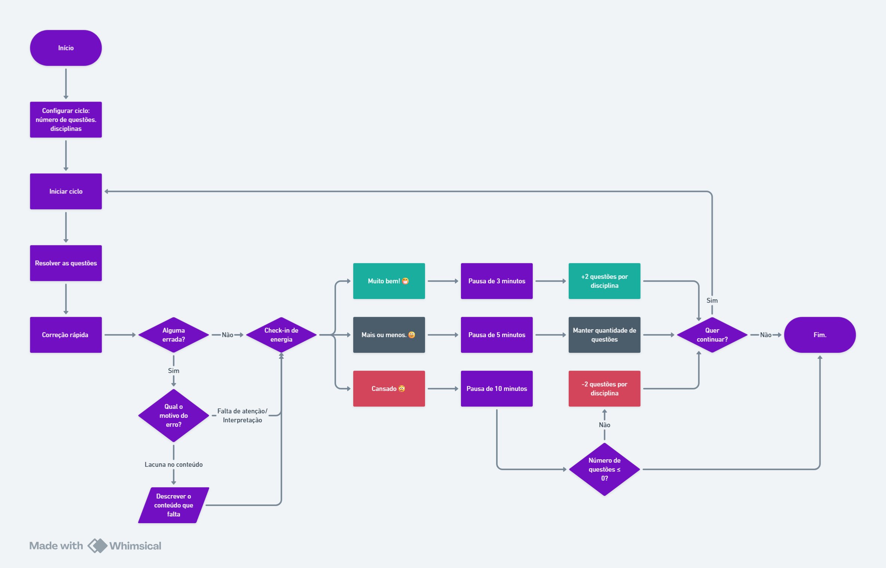

# Pomoq

Aplicativo web focado em estudo com ciclos de sessao, check-in de energia e historico de desempenho.

## Fluxograma do App



## O que o app faz

- Controle de sessao de estudo por fases (setup, estudo, revisao, check-in, pausa e finalizacao).
- Dashboard com graficos de volume, disciplina, energia e acuracia.
- Relatorios e historico de sessoes.
- Autenticacao com Supabase.
- Estrutura pronta para PWA (instalavel).

## Stack

- `Vue 3` + `TypeScript`
- `Vite`
- `Pinia` (estado)
- `Vue Router`
- `Supabase`
- `Chart.js` + `vue-chartjs`

## Rotas principais

- `/login`: autenticacao
- `/`: fluxo principal da sessao de estudo
- `/dashboard`: visualizacao de metricas
- `/report`: relatorios
- `/settings`: configuracoes

## Como rodar localmente

### 1. Instalar dependencias

```bash
npm install
```

### 2. Configurar variaveis de ambiente

Crie um arquivo `.env` na raiz com:

```env
VITE_SUPABASE_URL=...
VITE_SUPABASE_ANON_KEY=...
```

### 3. Iniciar em desenvolvimento

```bash
npm run dev
```

## Scripts

- `npm run dev`: inicia servidor de desenvolvimento
- `npm run build`: type-check + build de producao
- `npm run preview`: serve build localmente
- `npm run format`: formata arquivos em `src/`

## Estrutura resumida

- `src/pages/`: telas principais
- `src/components/session/`: componentes das fases da sessao
- `src/components/charts/`: componentes de graficos
- `src/stores/`: estado global (auth, historico, sessao)
- `src/lib/supabase.ts`: cliente Supabase

## Observacoes

- O app exige autenticacao para as rotas principais.
- Se as variaveis do Supabase nao estiverem definidas, a aplicacao falha na inicializacao.
